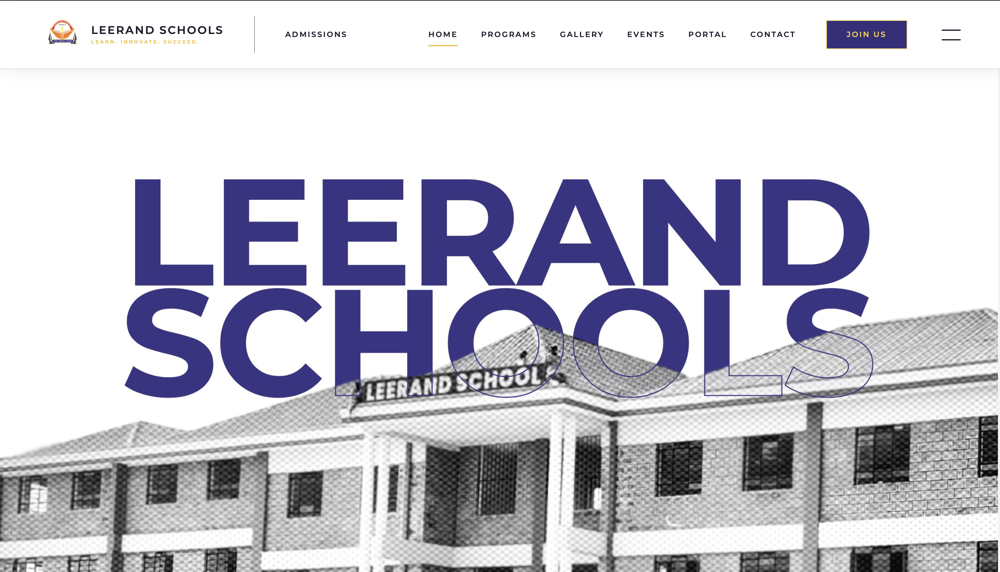

# Leerand Schools Website

A responsive school website for Leerand Schools, built as a modern admissions and communications experience for parents, students, and staff. The project presents the school's identity, programmes, admissions path, gallery, contact information, and parent portal access through a polished React interface.

## Preview



## Project Overview

This website was designed to feel like a real school brand experience rather than a static brochure. It combines large-format photography, scroll-based motion, routed pages, and reusable content sections to help families quickly understand the school and take action.

Key goals:

- Present Leerand Schools with a professional, recruiter-ready visual standard.
- Make important parent journeys easy to find: programmes, admissions, contacts, gallery, and portal login.
- Use real school imagery and structured sections to communicate credibility.
- Build the frontend with maintainable React components and route-based page organization.
- Keep the site fast to run locally with Vite and simple production build commands.

## Live Experience

The site includes these main routes:

- `/` - Homepage with hero imagery, school overview, entry points, leadership message, news, testimonials, events, and footer contact section.
- `/admissions` - Admissions hero, admissions overview, enquiry section, and contact footer.
- `/programs` - Academic programmes, curriculum framework, and co-curricular activities.
- `/gallery` - School life gallery and sports-focused visual sections.
- `/portal` - Parent portal introduction with a login link to the external SchoolPortal platform.
- `/contacts` - Contact hero, school contact details, and footer.

## Features

- Responsive React single-page application using `react-router-dom`.
- Smooth scrolling experience powered by Lenis.
- Page and section animations using Framer Motion, GSAP-style scroll reveals, and Intersection Observer patterns.
- Real school photography organized under `src/assets`.
- Reusable page sections for admissions, programmes, gallery, school life, events, testimonials, and contact content.
- Tailwind utility styling combined with component-level CSS for detailed visual control.
- External parent portal call-to-action linking to `https://leerand.esomakids.com`.
- ESLint configuration for React hooks, refresh safety, and general JavaScript quality.

## Tech Stack

- React 19
- Vite 6
- React Router 7
- Tailwind CSS 3
- Framer Motion
- Lenis smooth scrolling
- GSAP
- React Spring
- ESLint 9

## Project Structure

```text
LeerandSchools/
+-- public/                  # Favicons and static public assets
+-- src/
|   +-- assets/              # School photos, hero images, logos, fonts, gallery media
|   +-- components/          # Feature and page sections
|   |   +-- AboutUs/
|   |   +-- Admissions/
|   |   +-- Footer/
|   |   +-- Hero/
|   |   +-- Navbar/
|   |   +-- Programs/
|   |   +-- SchoolLife/
|   |   +-- ...
|   +-- App.jsx              # Route definitions and smooth-scroll shell
|   +-- index.css            # Global styles and Tailwind entry
|   +-- main.jsx             # React app mount
+-- package.json             # Scripts and dependencies
+-- tailwind.config.js       # Tailwind content and theme setup
+-- vite.config.js           # Vite configuration
+-- eslint.config.js         # Linting rules
```

## Getting Started

### Prerequisites

- Node.js 18 or newer
- npm

### Installation

```bash
npm install
```

### Run Locally

```bash
npm run dev
```

Vite will print the local development URL, usually:

```text
http://localhost:5173
```

### Build for Production

```bash
npm run build
```

### Preview the Production Build

```bash
npm run preview
```

### Lint the Codebase

```bash
npm run lint
```

## Implementation Notes

- Routing is handled in `src/App.jsx`, where each page is composed from reusable components.
- The app uses a custom scroll container with Lenis, so route changes and hash links are coordinated through the `ScrollToTop` helper.
- Most major sections pair JSX components with colocated CSS files for finer control over layout, animation timing, and responsive behavior.
- Media assets are imported directly into components so Vite can optimize and fingerprint them during production builds.
- The homepage is intentionally visual-first, using school imagery to establish trust before moving into academic and admissions content.

## What I Focused On

- Component-based structure for a site that can grow beyond a single landing page.
- Clear parent-facing navigation and conversion paths.
- Visual polish through motion, spacing, typography, and photography.
- Practical maintainability: routes, sections, and assets are separated by feature area.
- Production-friendly workflow with standard `dev`, `build`, `preview`, and `lint` scripts.

## Future Improvements

- Add a CMS or admin interface for events, news, and gallery updates.
- Add form submission handling for admissions enquiries.
- Add automated tests for route rendering and critical user flows.
- Optimize large image and video assets further for slower network conditions.
- Add metadata and structured SEO content per route.

## Author

Built by Gregory Kago as a frontend school website project focused on React, responsive UI design, motion, and real-world information architecture.
